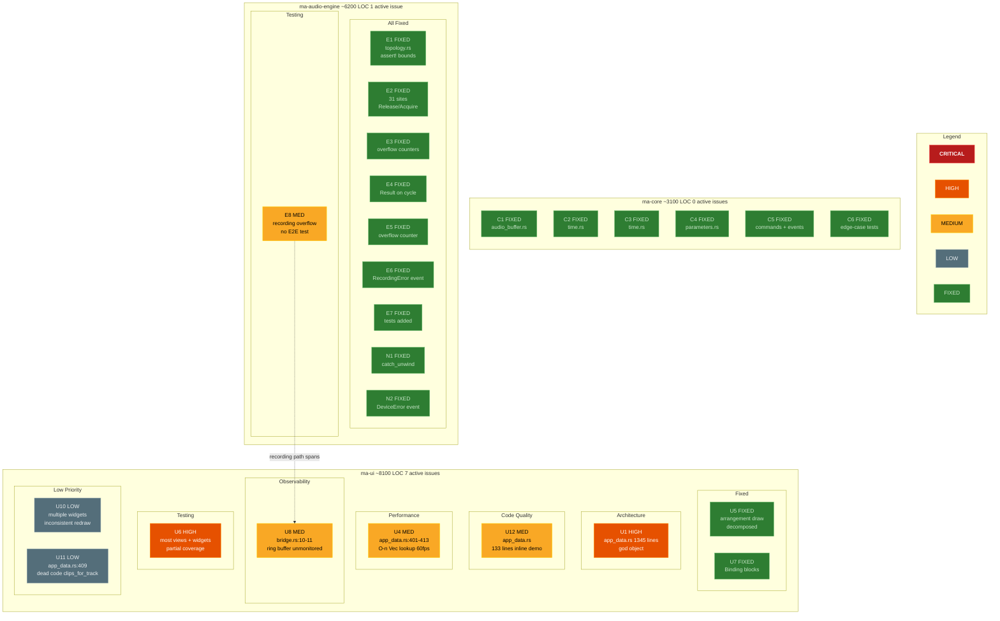
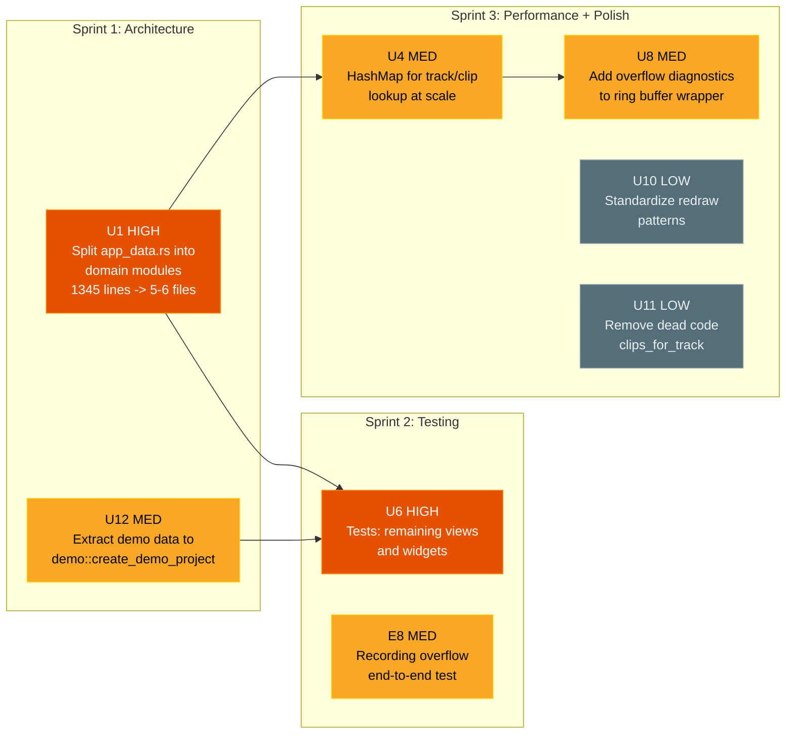
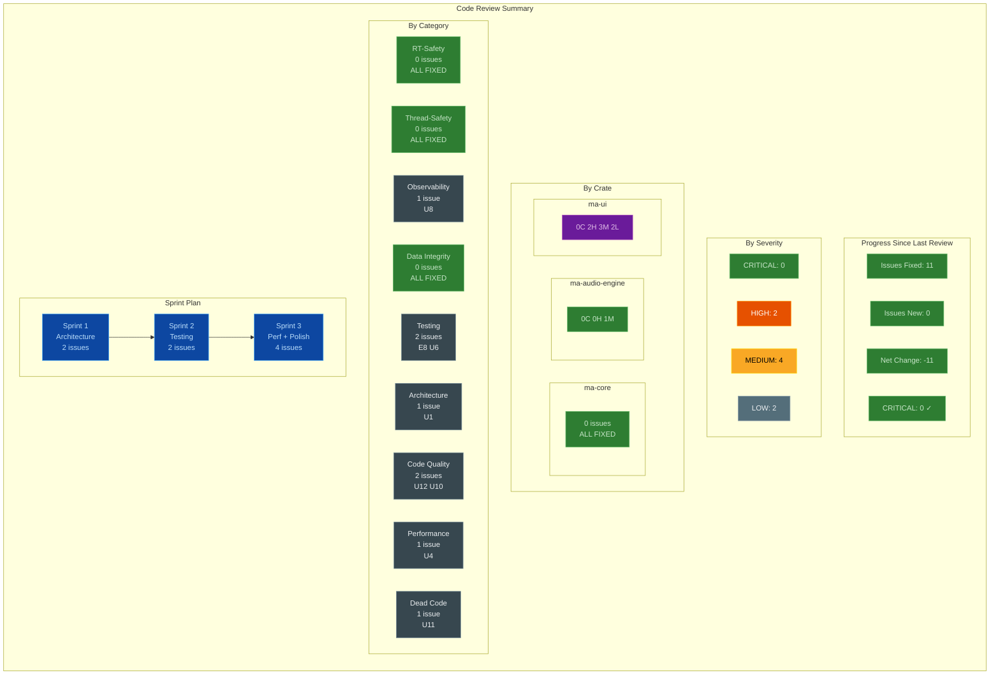

# Code Review Graph — milolew Audio

> Generated: 2026-03-25 | Codebase: ~17,400 LOC across 3 crates | Commit: 0e86840
> Previous review: 19 issues (2C/9H/6M/2L) | **This review: 8 issues (0C/2H/4M/2L)**
> Delta: **-11 fixed**, **+0 new** = net -11

---

## Summary

| | CRITICAL | HIGH | MEDIUM | LOW | Total | Delta |
|---|:---:|:---:|:---:|:---:|:---:|:---:|
| **ma-core** | 0 | 0 | 0 | 0 | **0** | — |
| **ma-audio-engine** | 0 | 0 | 1 | 0 | **1** | -9 |
| **ma-ui** | 0 | 2 | 3 | 2 | **7** | -2 |
| **Total** | **0** | **2** | **4** | **2** | **8** | **-11** |

### Build Status

| Check | Status |
|-------|--------|
| `cargo test --workspace` | 271 passed, 0 failed |
| `cargo clippy --workspace -- -D warnings` | 0 warnings |
| `cargo fmt --all -- --check` | 0 diffs |

---

## 1. Fixed Since Last Review

| ID | Was | Fix | Commit |
|----|-----|-----|--------|
| E1 | CRIT: unsafe ptr arithmetic with debug_assert-only bounds | `assert!()` with descriptive message replaces `debug_assert!()` on all unsafe pointer paths in `topology.rs:176-197` | bac607f |
| E2 | CRIT: 31 sites Relaxed atomic ordering | Release/Acquire on transport position, recording state, bridge reads; Relaxed documented as acceptable for volume/pan/mute/solo/armed (single-value eventual consistency) | bac607f |
| E3 | HIGH: 8 silent ring buffer overflow sites | `DROPPED_EVENTS` AtomicU32 in callback.rs, `overflow_samples` AtomicU64 in input_capture.rs, `record_overflow` AtomicBool in track_node.rs, `consecutive_write_errors` counter in disk_io.rs | bac607f |
| E4 | HIGH: topological_sort returns partial schedule on cycle | Returns `Result<Vec<NodeIndex>, TopologyError>` with diagnostic info (total/sorted/skipped counts); AudioGraph::new() propagates with `?` | bac607f |
| E5 | MED: input_capture no overflow counter | `overflow_samples: AtomicU64` with `take_overflow_samples()` read/reset method; 3 unit tests | bac607f |
| E6 | HIGH: silent WAV truncation on disk error | Consecutive write error counter; `RecordingError` event sent to UI after MAX_CONSECUTIVE_WRITE_ERRORS (10); finalization errors also emit events | bac607f |
| E7 | HIGH: command_processor, disk_io, device_manager zero tests | 14 tests for command_processor, 4 for disk_io, 3 for device_manager — all dispatch paths, error handling, and edge cases covered | bac607f |
| N1 | HIGH: no catch_unwind on audio thread | `std::panic::catch_unwind(AssertUnwindSafe(…))` wraps audio_callback_inner; panic → silence + `has_panicked` flag (Release) + `AudioThreadPanic` event | bac607f |
| N2 | HIGH: cpal errors not propagated to UI | cpal error callback stores error code in AtomicU8; callback.rs reads flag and emits `EngineEvent::DeviceError` with mapped `StreamErrorCode` | bac607f |
| U5 | HIGH: 281-line monolithic TrackLane::draw() | Decomposed into `arrangement/` module: `grid.rs` (75L), `clip_renderer.rs` (262L), `live_waveform.rs` (75L), `playhead.rs` (40L); TrackLane::draw() now ~109 lines | 58bd185 |
| U7 | MED: format!() allocating String every frame | All format!() calls wrapped in `Binding` blocks — only trigger on data change, not per-frame | 4a43bdc |

---

## 2. Active Issue Catalog

### ma-audio-engine (1 issue)

| ID | Severity | Category | Location | Description |
|----|----------|----------|----------|-------------|
| E8 | MEDIUM | Testing | recording path | Recording overflow path (input capture → track_node → disk_io) has no end-to-end test; unit tests cover individual overflow counters but no integration scenario verifying `RecordingOverflow` event emission through the full chain |

### ma-ui (7 issues)

| ID | Severity | Category | Location | Description |
|----|----------|----------|----------|-------------|
| U1 | HIGH | Architecture | `app_data.rs` (1345 lines) | God object: state partially extracted to `TransportState`, `MixerState`, `PianoRollState`, `ArrangementState` structs, but AppData still owns all structs directly and handles all event dispatch — file grew from 765→1345 lines due to new features (browser, file loading, project save/load, audio import) |
| U6 | HIGH | Testing | most `views/`, most `widgets/` | Partial test coverage: arrangement (14 tests), piano_roll (12 tests), pan_knob (3 tests) added; but fader, knob, keyboard_strip, master_strip, peak_meter, timeline_ruler, transport_bar, channel_strip, meter_utils still at zero |
| U4 | MEDIUM | Performance | `app_data.rs:401-413` | `track()`, `clip()`, `clips_for_track()` use `Vec::iter().find()` — O(n) per call at 60fps; acceptable at 4 tracks, problematic at 50+ |
| U8 | MEDIUM | Observability | `bridge.rs:10-11` | Ring buffer capacities hard-coded (256 commands, 1024 events) with zero monitoring — `create_bridge_with_capacity()` exists but no runtime overflow alerting |
| U12 | MEDIUM | Code Quality | `app_data.rs:198-330` | ~133 lines of inline demo data in `AppData::new()` — 4 tracks + 4 clips with embedded MIDI notes; should be extracted to `demo::create_demo_project()` |
| U10 | LOW | Consistency | multiple widgets | Inconsistent `cx.needs_redraw()` patterns — annotated with inline `REDRAW:` comments documenting rationale (on-change vs. animated vs. scroll) but no consistent enforcement |
| U11 | LOW | Dead Code | `app_data.rs:409-413` | `clips_for_track()` returns `Vec<&ClipState>` (allocates), but views filter clips inline via `iter().filter()` — confirmed unused by grep |

---

## 3. Master Issue Graph

---

## 4. Fix Priority DAG

### Dependency Rationale

| Arrow | Reason |
|-------|--------|
| U1 → U6 | Split god object before writing targeted tests against smaller modules |
| U12 → U6 | Extract demo data so tests can construct test fixtures cleanly |
| U1 → U4 | Split app_data before switching lookup strategy — HashMap ownership is cleaner in decomposed modules |
| U4 → U8 | Performance improvements complete before adding diagnostics on buffer capacities |

### Parallelism Within Sprints

| Sprint | Track A | Track B | Track C |
|--------|---------|---------|---------|
| 1 | U1 (split app_data) | U12 (extract demo data) | — |
| 2 | U6 (widget/view tests) | E8 (recording E2E) | — |
| 3 | U4 + U8 (performance + diagnostics) | U10 + U11 (cleanup) | — |

---

## 5. Summary Dashboard

---

## 6. Critical Files (Ordered by Risk)

| File | Issues | Risk | Lines |
|------|--------|------|-------|
| `ma-ui/src/app_data.rs` | U1, U4, U11, U12 | **Highest**: god object blocking 3 downstream fixes; grew from 765→1345 | 1345 |
| `ma-ui/src/views/arrangement/mod.rs` | (U6 partial) | **Medium**: main view logic; has 14 tests now, draw decomposed | 661 |
| `ma-ui/src/bridge/bridge.rs` | U8 | **Medium**: ring buffer unmonitored | — |
| `ma-audio-engine/src/callback.rs` | E8 (indirectly) | **Low**: recording path untested E2E; all prior safety issues fixed | 292 |

---

## 7. Test Coverage Matrix

| Module | Unit Tests | Integration | Notes |
|--------|:---:|:---:|-------|
| ma-core/audio_buffer.rs | 42 | - | Comprehensive |
| ma-core/time.rs | 31 | - | Good coverage |
| ma-core/midi_clip.rs | 14 | - | Good: range, sort, serialization |
| ma-core/parameters.rs | 12 | - | Good: newtype validation |
| ma-core/events.rs | 13 | - | Send/Sync + variant coverage |
| ma-core/commands.rs | 11 | - | Send/Sync + variant + debug |
| ma-core/project_file.rs | 5 | - | Round-trip, version check |
| ma-core/ids.rs | 3 | - | Uniqueness |
| ma-core/device.rs | 2 | - | Config round-trip |
| ma-audio-engine/command_processor.rs | 14 | - | **NEW**: all dispatch paths covered |
| ma-audio-engine/midi_player.rs | 14 | - | Audio synthesis + clip management |
| ma-audio-engine/midi_recorder.rs | 9 | - | Record flow + overflow |
| ma-audio-engine/engine.rs | 8 | - | Build + mixer commands + peak events |
| ma-audio-engine/transport.rs | 6 | - | State machine + loop + clamp |
| ma-audio-engine/input_capture.rs | 5 | - | Round-trip + overflow counter |
| ma-audio-engine/peak_cache.rs | 4 | - | Cache + range queries |
| ma-audio-engine/track.rs | 4 | - | Audio/MIDI create + recording |
| ma-audio-engine/disk_io.rs | 4 | - | **NEW**: record, finalize, error handling |
| ma-audio-engine/device_manager.rs | 3 | - | **NEW**: enumerate, error mapping |
| ma-audio-engine/audio_decode.rs | 3 | - | WAV decode mono/stereo/error |
| ma-audio-engine/export.rs | 2 | - | 16-bit + float32 WAV |
| ma-audio-engine/topology.rs | 2 | - | Order + no-panic |
| ma-audio-engine/e2e_smoke | - | 4 | **NEW**: playback, MIDI, export, project save/load |
| **ma-audio-engine/recording overflow** | **—** | **—** | **E8: no E2E test** |
| ma-ui/views/arrangement | 14 | - | **NEW**: hit-test + coordinate conversion |
| ma-ui/views/piano_roll | 12 | - | **NEW**: hit-test + pitch/tick conversion |
| ma-ui/state/browser_state | 8 | - | **NEW**: entries, filters, refresh |
| ma-ui/file_loader | 5 | - | **NEW**: MIDI parsing + errors |
| ma-ui/types/*.rs | 8 | - | BBT, snap, note helpers |
| ma-ui/widgets/pan_knob | 3 | - | **NEW**: pan formatting |
| ma-ui/config.rs | 1 | - | Preferences round-trip |
| **ma-ui/widgets/** (8 files) | **0** | - | **U6: untested** |
| **ma-ui/app_data.rs** | **0** | - | **U6: untested** |
| **Total** | **267** | **4** | 271 total; 9 modules at zero coverage (down from 14) |
